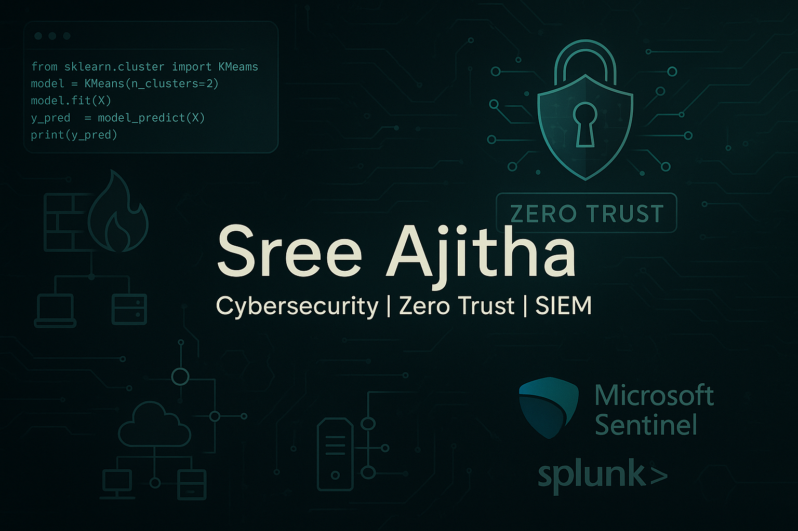

# 👋 Hi, I’m @Sree-Ajitha

---

## 👀 I’m interested in
Proactive threat detection, digital forensics, security automation, Zero Trust Architecture (ZTA), and culturally inclusive cybersecurity frameworks (e.g., Māori data sovereignty).

## 🌱 I’m currently learning
- Cloud-native security in hybrid Azure/GCP environments  
- Dynamic threat signal clustering using SIEM+SOAR+ML pipelines  
- Advanced detection engineering with custom rule tuning in Sentinel & Elastic  
- Identity-centric security with Zero Trust integration in indigenous communities

## 💞️ I’m looking to collaborate on
- SOC workflow automation using open-source tools  
- Research and implementation of empathetic cybersecurity (Digital Empathy + ZTA)  
- DFIR playbook development and purple teaming exercises

## 📫 How to reach me
- **Email:** [sree@hotmail.co.nz](mailto:sree@hotmail.co.nz)  
- **LinkedIn:** [linkedin.com/in/sreeaj](https://www.linkedin.com/in/sreeaj)  
- **GitHub:** [github.com/Sree-Ajitha](https://github.com/Sree-Ajitha)

## 😄 Pronouns
He / Him

## ⚡ Fun fact
I once built a full detection-to-response pipeline using open-source SOAR, integrating TheHive, Cortex, and Shuffle—within a virtual SOC lab with simulated threat actors.

---

## 🎓 Academic Profile

**Master of Information Technology**  
*Specialisation: Cybersecurity*  
Modules covered include:
- Cybersecurity fundamentals, DFIR, and ethical hacking  
- Threat intelligence and risk governance  
- Technology management and secure infrastructure design  
- Research project: *Embedding Digital Empathy in Zero Trust Architectures to Build Māori Digital Identity Trust*

**Graduate Diploma in Computer Networking**  
- VPN protocol analysis, firewall deployments, and Linux server management  
- Cisco, Fortinet, and Microsoft security stack exposure

**Bachelor of Science in Computer Science Engineering**  
- Final project on neural network-based password authentication system  

---

## 🎯 Objective

As a cybersecurity professional blending deep technical expertise with a systems-thinking mindset, I aim to architect cyber-resilient ecosystems. My passion lies in designing threat-aware infrastructures that fuse automation, cultural intelligence, and cloud-native principles to address evolving global cyber risks.

My goal is to contribute to the development of ethical, scalable, and inclusive cybersecurity practices—especially in contexts where trust, sovereignty, and digital equity intersect.

---

## 🛠️ Core Skills & Associated Projects

| **Skill**                                         | **Associated Lab / Project**                                                                                  |
| ------------------------------------------------- | ------------------------------------------------------------------------------------------------------------- |
| SIEM Implementation & Log Analysis                | [Detection Lab](https://github.com/clong/DetectionLab)                                                        |
| Network Traffic Monitoring & Attack Detection     | [Detection Lab](https://github.com/clong/DetectionLab)                                                        |
| Security Automation with Shuffle SOAR             | [SOC Automation Lab](https://github.com/Sree-Ajitha/soc-automation-lab)                                       |
| Incident Response Planning & Execution            | [SOC Automation Lab](https://github.com/Sree-Ajitha/soc-automation-lab)                                       |
| Case Management with TheHive                      | [SOC Automation Lab](https://github.com/Sree-Ajitha/soc-automation-lab)                                       |
| Scripting & Automation for Threat Mitigation      | [SOC Automation Lab](https://github.com/Sree-Ajitha/soc-automation-lab)                                       |

---

## 🔧 Tools & Technologies

### 🔌 Network Analysis
- **Wireshark** — Deep packet inspection  
- **Suricata** — Real-time IDS/IPS & NSM  
- **Zeek** — Passive network traffic analysis & scripting

### 💻 Endpoint Security & Forensics
- **Microsoft Defender for Endpoint** — EDR & advanced hunting  
- **Velociraptor** — Host-based live forensics and threat hunting

### 📊 SIEM & Log Aggregation
- **Microsoft Sentinel** — Cloud-native SIEM  
- **Splunk** — Enterprise log analysis & correlation  
- **Elastic Security (ELK)** — Open-source log management and SIEM

### 🤖 Security Automation / SOAR
- **Shuffle SOAR** — Custom playbook automation  
- **TheHive + Cortex** — Case management and IOC enrichment  
- **PowerShell / Python** — Scripting for remediation, IOC triage, and automation  

### ☁️ Cloud & Identity
- **Azure AD / Entra ID** — Identity governance & Zero Trust enforcement  
- **Google Cloud IAM & Security Command Center**  
- **Terraform / YAML** — Infrastructure as Code for security deployments

---

## 🛡️ Certifications

- **Microsoft:**  
  - AZ-900 (Azure Fundamentals)  
  - AI-900 (AI Fundamentals)  
  - SC-900 (Security, Compliance & Identity)  
  - MTA 98-365 & 98-366 (Windows Server & Networking)

- **Fortinet:**  
  - NSE 1, NSE 2, NSE 3 (Cybersecurity Awareness to Core Products)

- **Cisco:**  
  - Networking Basics, CyberOps Associate modules  

- **OffSec/HTB/SBT Labs:**  
  - Penetration testing, forensics, Linux CLI, OSINT  
  - Red team & blue team hybrid simulations  

- **Google Cloud:**  
  - Associate Cloud Engineer track  

---

## 🧪 Cybersecurity Home Lab Blueprint

A custom air-gapped environment that emulates modern adversary tactics and supports hands-on red/blue/purple teaming.

### 1️⃣ Virtual Lab Setup

- **Host OS:** Hardened Ubuntu LTS  
- **Hypervisor:** VMware Workstation Pro (trial) or VirtualBox (free)  
- **Network:** Dual NICs with pfSense VM as perimeter firewall  

### 2️⃣ Lab Segmentation

- **VLAN 192.168.50.0/24**: Internal isolated network  
- **pfSense Firewall**: Routing, NAT, and traffic control  
- **AD Domain Setup:** Windows Server 2022 + DNS + GPOs

### 3️⃣ VM Deployments

| Role          | OS                | Tools Installed                                                                 |
| ------------- | ----------------- | -------------------------------------------------------------------------------- |
| Attacker      | Kali Linux        | Metasploit, Cuckoo, REMnux, Burp Suite, Nmap                                     |
| Victim 1      | Windows 7         | Exploit-vulnerable setup, Sysmon, Winlogbeat                                     |
| Victim 2      | Windows 10        | Defender EDR, MITRE ATT&CK simulations                                           |
| Victim 3      | Windows 11        | PowerShell logging, Velociraptor agent                                           |
| Victim 4      | Windows Server    | AD, DNS, LDAP attacks, Group Policy simulation                                   |

### 4️⃣ Tools Integration

- **Monitoring:** Wireshark, Zeek  
- **Detection:** Suricata, ELK Stack, Sentinel (via Azure ARC)  
- **Automation:** Shuffle SOAR → triggers → TheHive cases → Cortex enrichment  
- **Forensics:** Velociraptor + KAPE (evidence collection automation)

### 5️⃣ Attack Simulation Scenarios

- Brute-force with Hydra & mimikatz  
- Lateral movement (SMB relay, WMI exec)  
- Privilege escalation (unquoted service paths, UAC bypass)  
- Ransomware containment and recovery drills  

---

## 🚀 Let's Connect!

- 🌐 Explore my [Detection Lab Use Cases](https://github.com/clong/DetectionLab)  
- ⚙️ Dive into [SOC Automation Lab](https://github.com/Sree-Ajitha/soc-automation-lab)  
- 🔎 Research in progress: *Human-Centric Zero Trust for Indigenous Data Sovereignty*  
- 📫 Contact me on LinkedIn to discuss professional opportunities, projects, or knowledge-sharing

---

*Last updated: 2025-06-26*